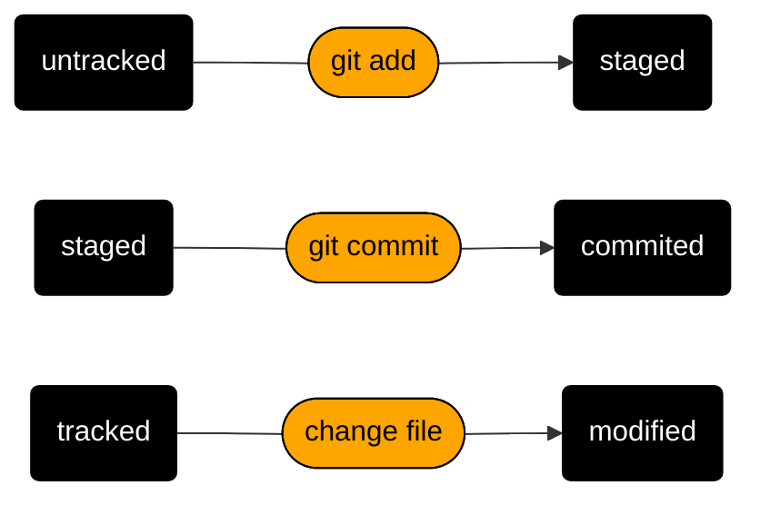

# Процесс создания условий для работы с удаленным репозиторием
## Создание локального репозитория 

```
$ pwd && ls # посмотрели в какой папке находимся и какие файлы в ней есть
$ git init # инициализировали репозиторий на локальной машине
$ git config -l # посмотрели имя и адрес 
```

## Создание удаленного репозитория 
1. Заходим в профиль на [github](https://github.com/new "github!") 
2. Создаем новый репозиторий и называем его *Second-project*
3. Выбираем настройку приватности репозитория *Private*
4. Нажимаем кнопку *Create repository*

## Создание ключа безопасности SSH для устройства
Для безопасной работы локальной машины в github необходимо использовать SSH ключ, чтобы его создать потребуется в гите получить его адрес и внести на [github](https://github.com/settings/keys)

```
$ ls -la .ssh/ # вывели список созданных ключей 
$ ssh-keygen -t ed25519 -C "электронная почта, к которой привязан ваш аккаунт на GitHub" 
$ ls -la .ssh/ # вывели список созданных ключей 
$ clip < ~/.ssh/id_ed25519.pub #скопировать содержимое ключа в буфер обмена
$ ssh -T git@github.com #проверка правильности подключения
```
## Привязка удаленного репозитория к локальному 

```
$ git remote add origin git@github.com:Botalchik/Second-project.git # связываем репозитории
$ git remote -v # проверяем, что репозитории связаны
```

## Работа в удаленном репозитории 

```
$ touch text1.txt text2.html # создали нужные документы
$ git status # перед комитом посмотрели информацию о репозитории 
$ git add . && git commit -m "Create Read me" # добавили информацию об изменениях и закомитили изменения на локальной машине
$ git push -u origin master # отправка изменений в удаленный репозиторий. В дальнейшем просто git push
$ git log # смотрим логи коммитов git log --oneline смотрим комментарии к комитам + сокаращенный хеш
$ git commit -- amend --no-edit # исправить последний коммит
$ git commit -- amend -m "New message" # исправить последний коммит
$ git restore --staged <file> # убрать файл из стейджа
$ git reset --hard <commit hash> # откатить коммит до состояния хеша
$ git restore <file> # откатить изменения, которые не попали ни в стейдж ни в коммит
```

## В результате получаем 

```
$ git push -u origin master
```

```Enumerating objects: 3, done.
Counting objects: 100% (3/3), done.
Delta compression using up to 8 threads
Compressing objects: 100% (2/2), done.
Writing objects: 100% (3/3), 243 bytes | 243.00 KiB/s, done.
Total 3 (delta 0), reused 0 (delta 0), pack-reused 0
To github.com:Botalchik/Second-project.git
 * [new branch]      master -> master
branch 'master' set up to track 'origin/master'. 
```

## Статусы в Git



## Подсказки 
* Раздел HEAD содержит хеш последнего коммита
* С помощью mermaid создают схемы в markdown
* Комментарии к коммитам должны писаться по корпоративным правилам 


## Полезные ресурсы 
* [Шпаргалка базовые команды консоли](https://practicum.yandex.ru/trainer/git-basics/lesson/fe0bcd71-f592-423b-bb81-27c37a6a115b/)